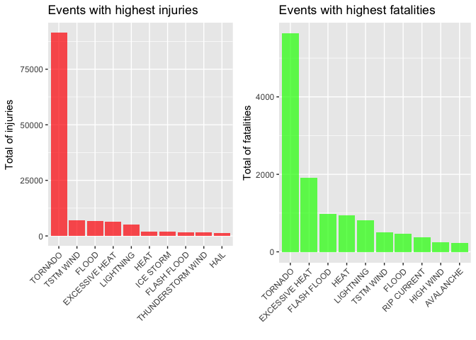
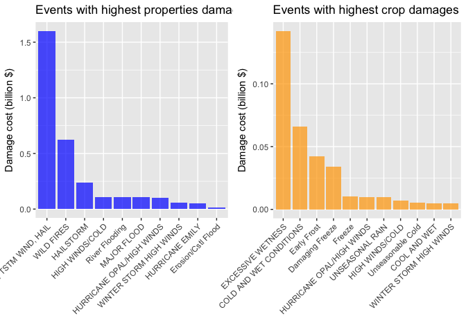

# Studies on the effect of weather events on personal as well as property damages in US based on NOAA database


# Synopsis
Storms and other severe weather events can cause both public health and economic problems for communities and municipalities. Many severe events can result in fatalities, injuries, and property damage, and preventing such outcomes to the extent possible is a key concern.

This project involves exploring the U.S. National Oceanic and Atmospheric Administration’s (NOAA) storm database. This database tracks characteristics of major storms and weather events in the United States, including when and where they occur, as well as estimates of any fatalities, injuries, and property damage.

In this report,effect of weather events on personal as well as property damages was studied. Barplots were plotted seperately for the top 10 weather events that causes highest fatalities and highest injuries. Results indicate that most Fatalities and injuries were caused by Tornados. Also, barplots were plotted for the top 8 weather events that causes the highest property and crop damages.


# Data
The data for this assignment come in the form of a comma-separated-value file compressed via the bzip2 algorithm to reduce its size. You can download the file from the course web site:

* Storm Data [47Mb](https://d396qusza40orc.cloudfront.net/repdata%2Fdata%2FStormData.csv.bz2)

There is also some documentation of the database available. Here you will find how some of the variables are constructed/defined.

* National Weather Service [Storm Data Documentation](https://d396qusza40orc.cloudfront.net/repdata%2Fpeer2_doc%2Fpd01016005curr.pdf)
* National Climatic Data Center Storm Events [FAQ](https://d396qusza40orc.cloudfront.net/repdata%2Fpeer2_doc%2FNCDC%20Storm%20Events-FAQ%20Page.pdf)
The events in the database start in the year 1950 and end in November 2011. In the earlier years of the database there are generally fewer events recorded, most likely due to a lack of good records. More recent years should be considered more complete.

# Assignment
The basic goal of this assignment is to explore the NOAA Storm Database and answer the following basic questions about severe weather events.

* Across the United States, which types of events (as indicated in the EVTYPE variable) are most harmful with respect to population health?
* Across the United States, which types of events have the greatest economic consequences?

# Data Processing
## Loading the data
The data was downloaded from the above mentioned website and saved on local computer. Then it was loaded on the R using the following code.


```r
## Loading needed libraries
library(readr)
library(dplyr)
```

```
## 
## Attaching package: 'dplyr'
```

```
## The following objects are masked from 'package:stats':
## 
##     filter, lag
```

```
## The following objects are masked from 'package:base':
## 
##     intersect, setdiff, setequal, union
```

```r
library(ggplot2)
library(grid)
library(gridExtra)
```

```
## 
## Attaching package: 'gridExtra'
```

```
## The following object is masked from 'package:dplyr':
## 
##     combine
```

```r
## Loading the data from a csv file
storm_data <- read_csv("./repdata%2Fdata%2FStormData.csv", col_names = TRUE)
```

```
## Parsed with column specification:
## cols(
##   .default = col_character(),
##   STATE__ = col_double(),
##   COUNTY = col_double(),
##   BGN_RANGE = col_double(),
##   COUNTY_END = col_double(),
##   END_RANGE = col_double(),
##   LENGTH = col_double(),
##   WIDTH = col_double(),
##   F = col_integer(),
##   MAG = col_double(),
##   FATALITIES = col_double(),
##   INJURIES = col_double(),
##   PROPDMG = col_double(),
##   CROPDMG = col_double(),
##   LATITUDE = col_double(),
##   LONGITUDE = col_double(),
##   LATITUDE_E = col_double(),
##   LONGITUDE_ = col_double(),
##   REFNUM = col_double()
## )
```

```
## See spec(...) for full column specifications.
```

```r
## Exploring the fist 6 lines of the dataset
head(storm_data)
```

```
## # A tibble: 6 × 37
##   STATE__           BGN_DATE BGN_TIME TIME_ZONE COUNTY COUNTYNAME STATE
##     <dbl>              <chr>    <chr>     <chr>  <dbl>      <chr> <chr>
## 1       1  4/18/1950 0:00:00     0130       CST     97     MOBILE    AL
## 2       1  4/18/1950 0:00:00     0145       CST      3    BALDWIN    AL
## 3       1  2/20/1951 0:00:00     1600       CST     57    FAYETTE    AL
## 4       1   6/8/1951 0:00:00     0900       CST     89    MADISON    AL
## 5       1 11/15/1951 0:00:00     1500       CST     43    CULLMAN    AL
## 6       1 11/15/1951 0:00:00     2000       CST     77 LAUDERDALE    AL
## # ... with 30 more variables: EVTYPE <chr>, BGN_RANGE <dbl>,
## #   BGN_AZI <chr>, BGN_LOCATI <chr>, END_DATE <chr>, END_TIME <chr>,
## #   COUNTY_END <dbl>, COUNTYENDN <chr>, END_RANGE <dbl>, END_AZI <chr>,
## #   END_LOCATI <chr>, LENGTH <dbl>, WIDTH <dbl>, F <int>, MAG <dbl>,
## #   FATALITIES <dbl>, INJURIES <dbl>, PROPDMG <dbl>, PROPDMGEXP <chr>,
## #   CROPDMG <dbl>, CROPDMGEXP <chr>, WFO <chr>, STATEOFFIC <chr>,
## #   ZONENAMES <chr>, LATITUDE <dbl>, LONGITUDE <dbl>, LATITUDE_E <dbl>,
## #   LONGITUDE_ <dbl>, REMARKS <chr>, REFNUM <dbl>
```

```r
## Exploring the dataset structure
spec(storm_data)
```

```
## cols(
##   STATE__ = col_double(),
##   BGN_DATE = col_character(),
##   BGN_TIME = col_character(),
##   TIME_ZONE = col_character(),
##   COUNTY = col_double(),
##   COUNTYNAME = col_character(),
##   STATE = col_character(),
##   EVTYPE = col_character(),
##   BGN_RANGE = col_double(),
##   BGN_AZI = col_character(),
##   BGN_LOCATI = col_character(),
##   END_DATE = col_character(),
##   END_TIME = col_character(),
##   COUNTY_END = col_double(),
##   COUNTYENDN = col_character(),
##   END_RANGE = col_double(),
##   END_AZI = col_character(),
##   END_LOCATI = col_character(),
##   LENGTH = col_double(),
##   WIDTH = col_double(),
##   F = col_integer(),
##   MAG = col_double(),
##   FATALITIES = col_double(),
##   INJURIES = col_double(),
##   PROPDMG = col_double(),
##   PROPDMGEXP = col_character(),
##   CROPDMG = col_double(),
##   CROPDMGEXP = col_character(),
##   WFO = col_character(),
##   STATEOFFIC = col_character(),
##   ZONENAMES = col_character(),
##   LATITUDE = col_double(),
##   LONGITUDE = col_double(),
##   LATITUDE_E = col_double(),
##   LONGITUDE_ = col_double(),
##   REMARKS = col_character(),
##   REFNUM = col_double()
## )
```

## Extracting the required data
For our analysis (after reading the docs), only some information is needed from the dataset. The rest of variables are not treated.

```r
## Selecting the right variables for our analysis
storm_data <- storm_data %>% select(EVTYPE, FATALITIES, INJURIES, PROPDMG, PROPDMGEXP, CROPDMG, CROPDMGEXP)

storm_data$EVTYPE <- as.factor(storm_data$EVTYPE)
storm_data$PROPDMGEXP <- as.factor(storm_data$PROPDMGEXP)
storm_data$CROPDMGEXP <- as.factor(storm_data$CROPDMGEXP)
```


## Processing the information about property and crop damages
We need to calculate the right property and crop damages amount according to the net value (PROPDMG and CROPDMG variables) and its exponential value (PROPDMGEXP and CROPDMGEXP variables).

### Calculating the right property damage value:

```r
# Reviewing the levels of exponential variable PROPDMGEXP
levels(storm_data$PROPDMGEXP)
```

```
##  [1] "-" "?" "+" "0" "1" "2" "3" "4" "5" "6" "7" "8" "B" "h" "H" "K" "m"
## [18] "M"
```

```r
# Assigning a nunerical value to this exponential
storm_data$PROPDMGEXPVAL[storm_data$PROPDMGEXP == "K"] <- 1000
```

```
## Warning: Unknown column 'PROPDMGEXPVAL'
```

```r
storm_data$PROPDMGEXPVAL[storm_data$PROPDMGEXP == "M"] <- 1e+06
storm_data$PROPDMGEXPVAL[storm_data$PROPDMGEXP == ""] <- 1
storm_data$PROPDMGEXPVAL[storm_data$PROPDMGEXP == "B"] <- 1e+09
storm_data$PROPDMGEXPVAL[storm_data$PROPDMGEXP == "m"] <- 1e+06
storm_data$PROPDMGEXPVAL[storm_data$PROPDMGEXP == "0"] <- 1
storm_data$PROPDMGEXPVAL[storm_data$PROPDMGEXP == "5"] <- 1e+05
storm_data$PROPDMGEXPVAL[storm_data$PROPDMGEXP == "6"] <- 1e+06
storm_data$PROPDMGEXPVAL[storm_data$PROPDMGEXP == "4"] <- 10000
storm_data$PROPDMGEXPVAL[storm_data$PROPDMGEXP == "2"] <- 100
storm_data$PROPDMGEXPVAL[storm_data$PROPDMGEXP == "3"] <- 1000
storm_data$PROPDMGEXPVAL[storm_data$PROPDMGEXP == "h"] <- 100
storm_data$PROPDMGEXPVAL[storm_data$PROPDMGEXP == "7"] <- 1e+07
storm_data$PROPDMGEXPVAL[storm_data$PROPDMGEXP == "H"] <- 100
storm_data$PROPDMGEXPVAL[storm_data$PROPDMGEXP == "1"] <- 10
storm_data$PROPDMGEXPVAL[storm_data$PROPDMGEXP == "8"] <- 1e+08
# Assigning '0' to invalid exponent data
storm_data$PROPDMGEXPVAL[storm_data$PROPDMGEXP == "+"] <- 0
storm_data$PROPDMGEXPVAL[storm_data$PROPDMGEXP == "-"] <- 0
storm_data$PROPDMGEXPVAL[storm_data$PROPDMGEXP == "?"] <- 0
# Calculating the property damage value
storm_data$PROPDMGVAL <- storm_data$PROPDMG * storm_data$PROPDMGEXPVAL
```

### Calculating the right crop damage value:

```r
# Reviewing the levels of exponential variable CROPDMGEXP
levels(storm_data$CROPDMGEXP)
```

```
## [1] "?" "0" "2" "B" "k" "K" "m" "M"
```

```r
# Assigning values for the crop exponent data 
storm_data$CROPEXPVAL[storm_data$CROPDMGEXP == "M"] <- 1e+06
```

```
## Warning: Unknown column 'CROPEXPVAL'
```

```r
storm_data$CROPEXPVAL[storm_data$CROPDMGEXP == "K"] <- 1000
storm_data$CROPEXPVAL[storm_data$CROPDMGEXP == "m"] <- 1e+06
storm_data$CROPEXPVAL[storm_data$CROPDMGEXP == "B"] <- 1e+09
storm_data$CROPEXPVAL[storm_data$CROPDMGEXP == "0"] <- 1
storm_data$CROPEXPVAL[storm_data$CROPDMGEXP == "k"] <- 1000
storm_data$CROPEXPVAL[storm_data$CROPDMGEXP == "2"] <- 100
storm_data$CROPEXPVAL[storm_data$CROPDMGEXP == ""] <- 1
# Assigning '0' to invalid exponent data
storm_data$CROPEXPVAL[storm_data$CROPDMGEXP == "?"] <- 0
# calculating the crop damage value
storm_data$CROPDMGVAL <- storm_data$CROPDMG * storm_data$CROPEXPVAL
```
## Finding total of injuries, fatalities, property damage and crop manage by event type

```r
#finding total sum of injuries by event type (getting the top 10)
injuries <- storm_data %>% group_by(EVTYPE) %>% summarise(TOTAL.INJURIES = sum(INJURIES)) %>% arrange(desc(TOTAL.INJURIES)) %>% top_n(10, TOTAL.INJURIES)

#finding total sum of fatalities by event type (getting the top 10)
fatalities <- storm_data %>% group_by(EVTYPE) %>% summarise(TOTAL.FATALITIES = sum(FATALITIES)) %>% arrange(desc(TOTAL.FATALITIES)) %>% top_n(10, TOTAL.FATALITIES)

#finding total sum of property damages by event type (getting the top 10)
properties <- storm_data %>% group_by(EVTYPE) %>% summarise(TOTAL.PROPDMG = sum(PROPDMGVAL)) %>% arrange(desc(TOTAL.PROPDMG)) %>% top_n(10, TOTAL.PROPDMG)

#finding total sum of crops damages by event type (getting the top 10)
crops <- storm_data %>% group_by(EVTYPE) %>% summarise(TOTAL.CROPDMG = sum(CROPDMGVAL)) %>% arrange(desc(TOTAL.CROPDMG)) %>% top_n(10, TOTAL.CROPDMG)
```


## Ploting the information to solve the questions
### Most harmful types of events with respect to population health

```r
# Plotting total injuries
p1 <- ggplot(injuries, aes(x = reorder(EVTYPE, -TOTAL.INJURIES), y = TOTAL.INJURIES))
p1 <- p1 + geom_bar(stat = "identity", alpha = 0.7, fill = "red") + ggtitle("Events with highest injuries") + xlab("") + ylab("Total of injuries")
p1 <- p1 + theme(axis.text.x = element_text(angle = 45, hjust = 1))

# Plotting total fatalities
p2 <- ggplot(fatalities, aes(x = reorder(EVTYPE, -TOTAL.FATALITIES), y = TOTAL.FATALITIES))
p2 <- p2 + geom_bar(stat = "identity", alpha = 0.7, fill = "green") + ggtitle("Events with highest fatalities") + xlab("") + ylab("Total of fatalities")
p2 <- p2 + theme(axis.text.x = element_text(angle = 45, hjust = 1))

## Plotting the both plots in the same grid
grid.newpage()
pushViewport(viewport(layout = grid.layout(1, 2)))
vplayout <- function(x, y) viewport(layout.pos.row = x, layout.pos.col = y)
print(p1, vp = vplayout(1, 1))
print(p2, vp = vplayout(1, 2))
```

<!-- -->

### Highest economic consecuences caused by events types

```r
# Plotting properties damages
p3 <- ggplot(properties, aes(x = reorder(EVTYPE, -TOTAL.PROPDMG), y = TOTAL.PROPDMG/1e+09))
p3 <- p3 + geom_bar(stat = "identity", alpha = 0.7, fill = "blue") + ggtitle("Events with highest properties damages") + xlab("") + ylab("Damage cost (billion $)")
p3 <- p3 + theme(axis.text.x = element_text(angle = 45, hjust = 1))

# Plotting crops damages
p4 <- ggplot(crops, aes(x = reorder(EVTYPE, -TOTAL.CROPDMG), y = TOTAL.CROPDMG/1e+09))
p4 <- p4 + geom_bar(stat = "identity", alpha = 0.7, fill = "orange") + ggtitle("Events with highest crop damages") + xlab("") + ylab("Damage cost (billion $)")
p4 <- p4 + theme(axis.text.x = element_text(angle = 45, hjust = 1))

## Plotting the both plots in the same grid
grid.newpage()
pushViewport(viewport(layout = grid.layout(1, 2)))
vplayout <- function(x, y) viewport(layout.pos.row = x, layout.pos.col = y)
print(p3, vp = vplayout(1, 1))
print(p4, vp = vplayout(1, 2))
```

<!-- -->


# Final results and insights
* After reviewing the plots, we can make the assessment that tornados cause the highest number of fatalities and injuries. It was followed by Excessive Heat for fatalities and Thunderstorm wind for injuries 

* Floods caused the maximum property damage whereas Drought caused the maximum crop damage. Second major events that caused the maximum damage was Hurricanes/Typhoos for property damage and Floods for crop damage.
